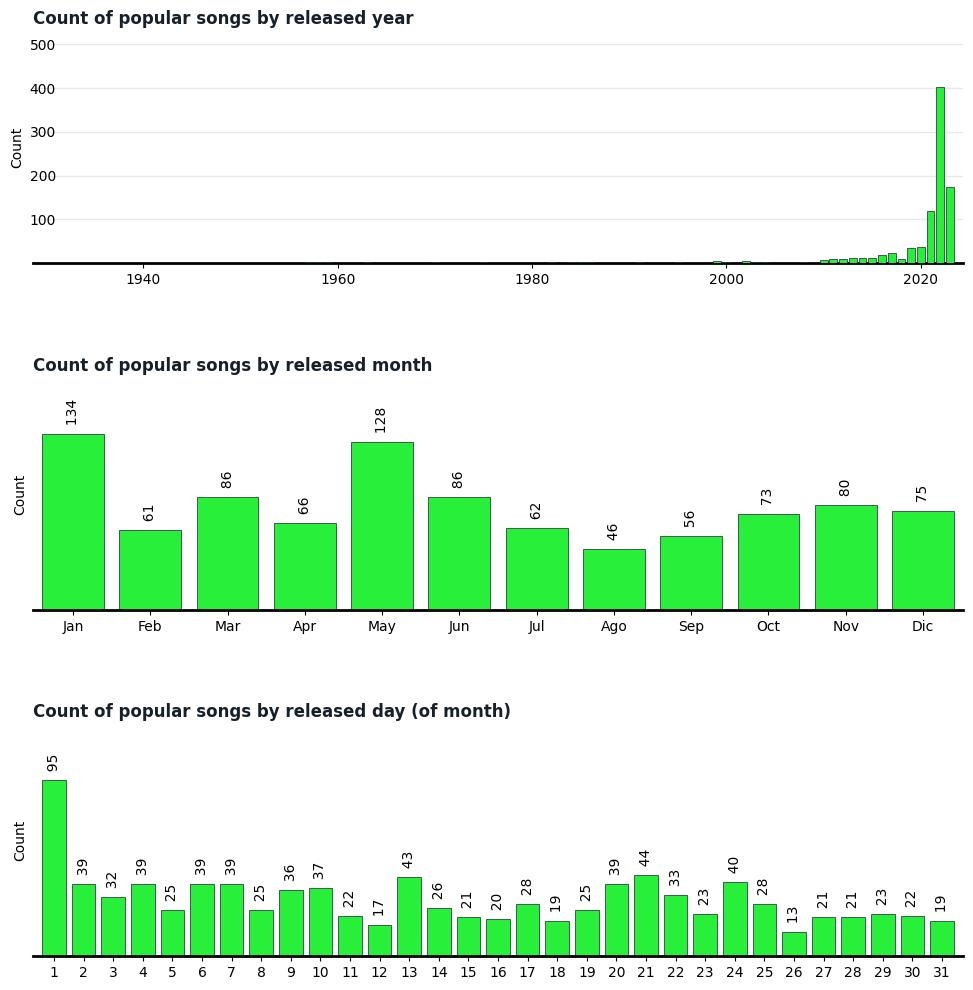
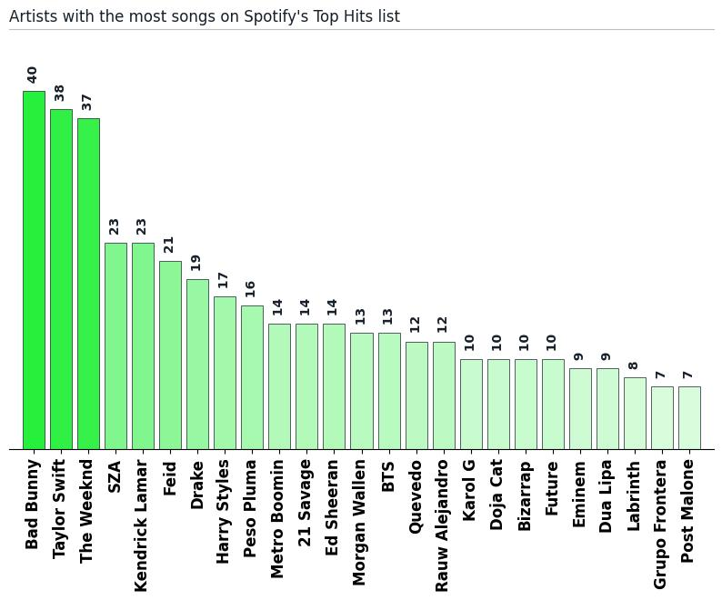
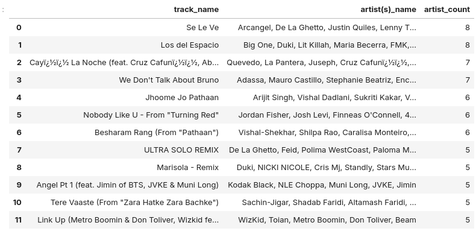
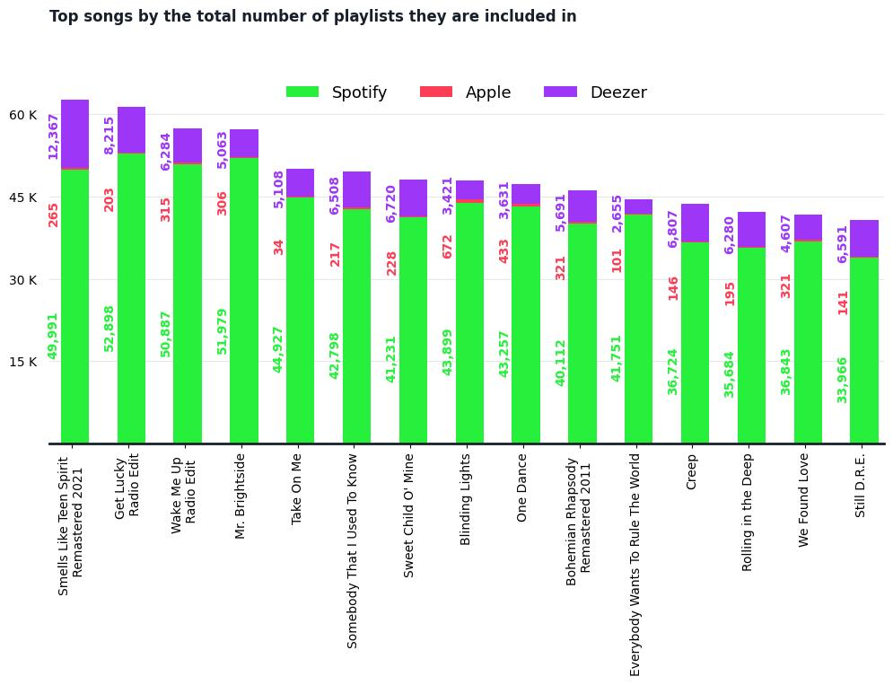
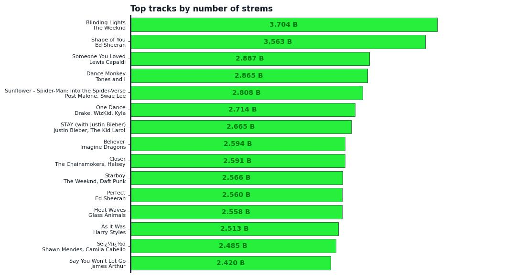
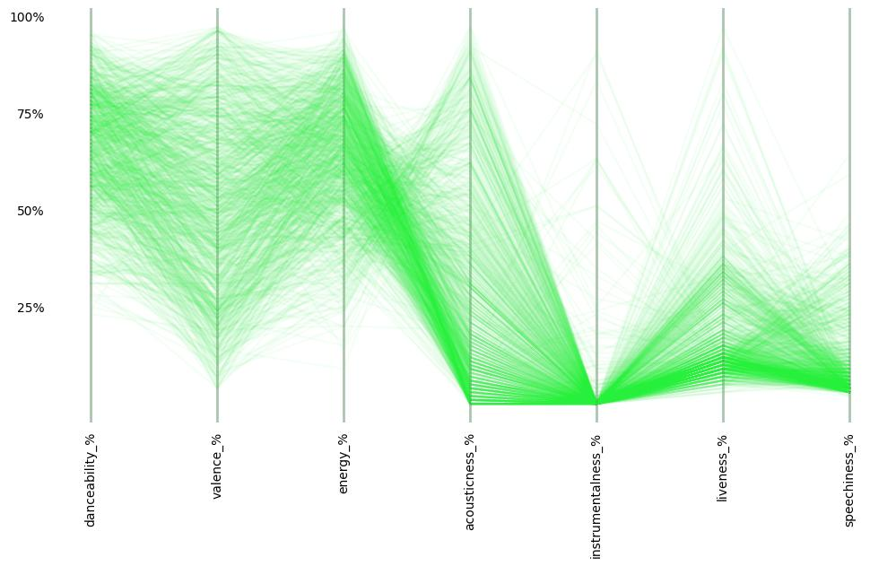

# Spptify Top Hits Uncovering Trends And Patterns

# 
<b>1 ❯</b> <b>BACKGROUND</b>

Spotify stands as the premier global music streaming platform, boasting approximately 80 million songs with nearly 60,000 fresh additions daily. Despite this vast library, certain tracks rise to prominence as the most popular on the platform. In this notebook, we'll be analyzing a dataset of the most popular songs in Spotify of all the time (measured by the total streming times).

### <b>❯❯❯  Notebook AIM
    
In this notebook, we'll be diving into a list of popular Spotify songs. Identifying trends in artists and songs popularity and audio characteristics among Spotify's most popular songs and artists through data analysis.
    
### <b>❯❯❯  Dataset content.
    
The dataset used in this notebook contains a list of the 953 most streamed songs in Spotify. Each track has the next 24 features. 
    
<ul>
    <li>Track_name:Name of the song</li>
    <li>Artist's_name:Name of the artist(s) who sing the song.</li>
    <li>Artist_countCount of artists who participaded in the song.</li>
    <li>Released_yearYear when the track was released.</li>
    <li>Released_month:Month when the track was released.</li>
    <li>Released_day:Day when the track was released.</li>
    <li>In_spotify_playlists:Count of playlists in which the track was included on Spotify</li>
    <li>In_deezer_playlists:Count of playlists in which the track was included on Deezer</li>
    <li>In_amazon_playlists:Count of playlists in which the track was included on Amazon Music</li>
    <li>Streams:Total streams of the song.</li>
    <li>In_spotify_charts:Count of Spotify charts in which the track was included in.</li>
    <li>In_deezer_charts:Count of Deezer charts in which the track was included in.</li>
    <li>In_apple_charts:Count of Apple Music charts in which the track was included in.</li>
    <li>In_zhazam_charts:Count of Zhazam charts in which the track was included in.</li>
    <li>btm:Beats Per Minute.</li>
    <li>danceability_%:A value assigned to the song that indicates how suitable it is for dancing</li>
    <li>valence_%:A value assigned to the song that indicates how "positivity" (100%) or negativity (0%) is.</li>
    <li>energy_%:A value indicating the relative level of "energy" in a song.</li>
    <li>acousticness_%:A value assigned to a song that indicates how reliant it is on acoustic instruments</li>
    <li>liveness_%:A value indicating the likelihood a song was recorded in a live setting with an audience.</li>
    <li>speechiness_%:A value indicating the presence of spoken word content.</li>
    <li>instrumentalness_%:A value indicating  how much of a song is instrumental.</li>
<ul>

## >>> Number of songs by released date

The released year of the most popular spotify songs ranges from 1930 to 2023. However, almost 9 out of 10 of these popular songs are from the last 10 years (88.5%). January and May are the months with most popular songs. Also, the 1st day of the month seems to have a high number of popular songs (possibly, artists tend to release their music on the first day of the month).

## >>> Artists with most popular songs

All the oldest popular songs in spotify (released before 1960) seems to be about christmas (except the first one from 1930).

## >>> Songs with the highest number of artists

Bad Bunny dominates Spotify's popular songs list with an impressive 40 songs! Taylor Swift and The Weeknd follow closely behind with 38 and 37 songs, respectively. A high gap of 14 splits the third and fourth places. 

## >>>Top tracks by the number of playlists they're included in

Smells Like Teen Spirit is the track included in most playlist (across all 3 platforms) wich more than 60 thousand, followed by Get Lucky (Daft Punk), also with more than 60 thusands. The rest of the top 5 are: Wake Me Up (Avicci), Mr. Bridgestone (The killers), Take on Me (a-Ha).
​
There is a huge gap between the number of playlists including the tracks in Spotify and the other two platforms (Apple Music and Deezer).

## >>> Top tracks by total streams

The top list of tracks by the total number of streams is completely different from the top of tracks by the total playlists they're included in.

Blinding Lights (by The Weekend) leads this top with more than 3.7 Billions, followed by Shape of You with more than 3.63 Billions of streams. Only the top 2 songs have more than 3 millions of streams. The next tracks in the top are Someone you Loved by Lewis Capeldi (2.887 Billions), Dance Monkey by Tones and I (2.865 Billions) and Sunflower - Spider Man by Post Malone and Swae Lee (2.808 billions). 

## >>> Trends on danceability, valence, ...

* Popular songs on Spotify typically favor high danceability (less suitable for dancing).
* They also lean towards lower energy levels.
* While the positivity (valence) varies across popular songs, there's no clear preference for a specific range. Similarly, acousticness can be all over the map.
* Interestingly, popular songs tend to have vocals (not instrumental), are typically studio recordings (low liveness), and have minimal spoken word content (low speechness).

Songs with a focus on acoustic instruments typically have lower energy levels and are less danceable. In contrast, dance music is characterized by high energy, positive emotions (high valence), and minimal use of acoustic instruments (low acousticness). Also, positive songs (high valance) have also high energy.
